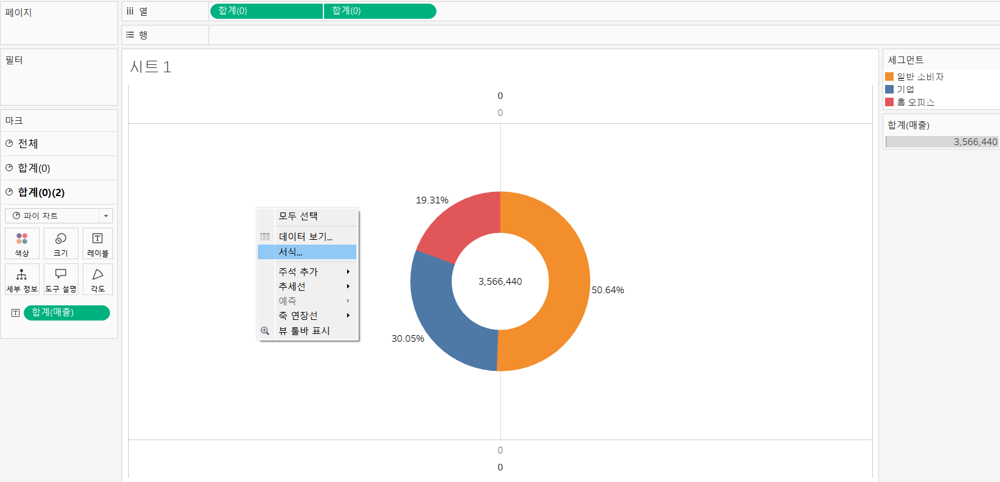
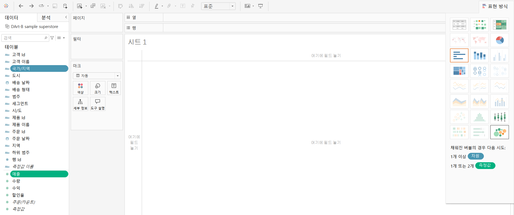
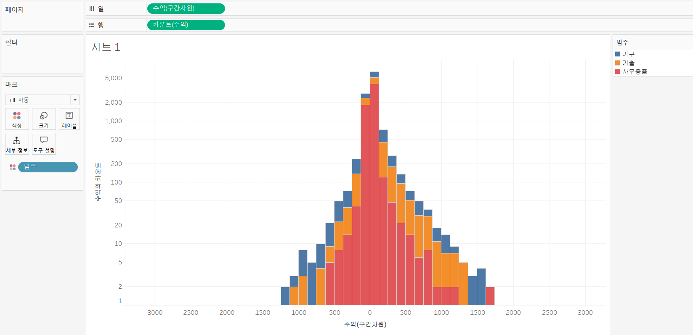
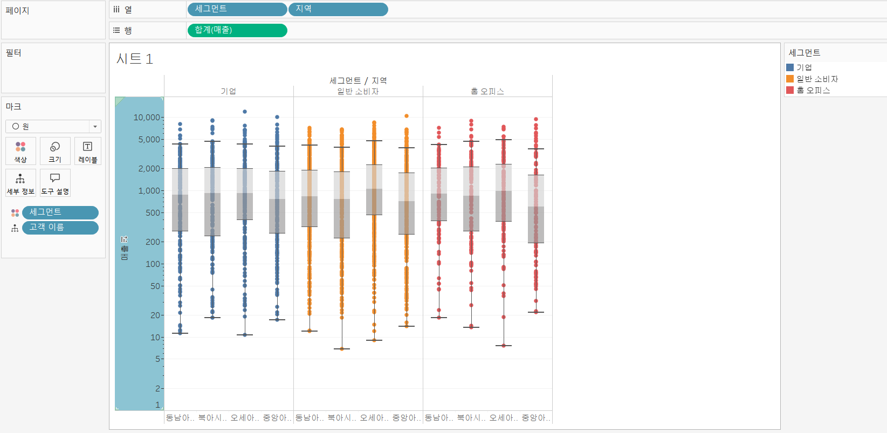

# Third Study Week

- 20강: [파이와 도넛차트](#20강-파이와-도넛차트)

- 21강: [워드와 버블차트](#21강-워드와-버블차트)

- 22강: [이중축과 결합축](#22강-이중축과-결합축)

- 23강: [분산형 차트](#23강-분산형-차트)

- 24강: [히스토그램](#24강-히스토그램)

- 25강: [박스플롯](#25강-박스플롯)

- 26강: [영역차트](#26강-영역차트)

- 27강: [간트차트](#27강-간트차트)

- 28강: [필터](#28강-필터)

- 29강: [그룹](#29강-그룹)


- 문제1 : [문제1](#문제1)

- 문제2 : [문제2](#문제2)

- 참고자료 : [참고자료](#참고-자료)


## Study Schedule

| 강의 범위     | 강의 이수 여부 | 링크                                                                                                        |
|--------------|---------|-----------------------------------------------------------------------------------------------------------|
| 1~9강        |  ✅      | [링크](https://youtu.be/3ovkUe-TP1w?si=CRjj99Qm300unSWt)       |
| 10~19강      | ✅      | [링크](https://www.youtube.com/watch?v=AXkaUrJs-Ko&list=PL87tgIIryGsa5vdz6MsaOEF8PK-YqK3fz&index=75)       |
| 20~29강      | ✅      | [링크](https://www.youtube.com/watch?v=Qcl4l6p-gHM)      |
| 30~39강      | 🍽️      | [링크](https://www.youtube.com/watch?v=e6J0Ljd6h44&list=PL87tgIIryGsa5vdz6MsaOEF8PK-YqK3fz&index=55)       |
| 40~49강      | 🍽️      | [링크](https://www.youtube.com/watch?v=AXkaUrJs-Ko&list=PL87tgIIryGsa5vdz6MsaOEF8PK-YqK3fz&index=45)       |
| 50~59강      | 🍽️      | [링크](https://www.youtube.com/watch?v=AXkaUrJs-Ko&list=PL87tgIIryGsa5vdz6MsaOEF8PK-YqK3fz&index=35)       |
| 60~69강      | 🍽️      | [링크](https://www.youtube.com/watch?v=AXkaUrJs-Ko&list=PL87tgIIryGsa5vdz6MsaOEF8PK-YqK3fz&index=25)       |
| 70~79강      | 🍽️      | [링크](https://www.youtube.com/watch?v=AXkaUrJs-Ko&list=PL87tgIIryGsa5vdz6MsaOEF8PK-YqK3fz&index=15)       |
| 80~89강      | 🍽️      | [링크](https://www.youtube.com/watch?v=AXkaUrJs-Ko&list=PL87tgIIryGsa5vdz6MsaOEF8PK-YqK3fz&index=5)        |


<!-- 여기까진 그대로 둬 주세요-->
<!-- 이 안에 들어오는 텍스트는 주석입니다. -->

# Third Study Week

## 20강: 파이와 도넛차트
<!-- 파이와 도넛차트에 관해 배우게 된 점을 적어주세요 -->
```
파이차트 : 전체에 대한 비율을 표시할 때 주로 사용
```

> **🧞‍♀️ 도넛차트를 생성하는 법을 기록해주세요.**

```
도넛차트 생성법 :

1. 세그먼트 및 매출 더블 클릭
2. 표현 방식에서 파이 차트로 변경
3. 매출을 레이블에 표시 및 구성비율로 변환 
```


```
파이차트 생성법 :

1. 기존 도넛차트에서 열에 0을 입력해 임의의 축 생성
2. 만든 0 필드를 Ctrl + 옆으로 드래그하면 두 개의 원이 생성됨
3. 분리된 파이 차트 표현을 위해 두 번째 마크에 있던 값들을 드롭하고 매출을 레이블에 표시
4. 양쪽 파이 차트의 크기 조절
5. 만든 두 번째 0필드에서 이중축 선택
6. 시트에서 오른쪽 마우스 서식 클릭 
- 테두리 서식에서 행 구분선과 열 구분선을 모두 없음으로 체크
- 라인 서식에서 영(0) 기준선 또한 없음으로 체크
7. 시트에서 위 아래 축 선택 후 머리글 표시 해제
8. 색상에서 테투리를 흰색으로 변경하면 완성!!
```





## 21강: 워드와 버블차트
<!-- 워드와 버블차트에 관해 배우게 된 점을 적어주세요 -->
```
버블차트 : 수치적 데이터를 원의 크기로 표현하는 차트

버블차트 생성법 :

1. Ctrl을 누른채로 국가/지역 및 매출 선택
2. 표현 방식에서 버블 차트 클릭
3. 매출을 색상으로 가져오기

국가별 매출에 따라 색상과 원의 크기로 표현한 버블 차트 완성!
```



```
워드 클라우드 : 문서 내에서 키워드가 얼마나 자주 등장하는지를 텍스트 크기로 표현

데이터에서 지역이 등장한 횟수를 카운트하고 그에 따른 크기를 표시하고자 함!

워드 클라우드 생성법 :

1. 국가/지역을 우클릭한 채 크기로 드래그
2. 카운트(국가/지역) 선택
3. 국가/지역을 레이블로 옮기면 아래 두 번째 사진처럼 트리맵 차트가 생성됨
4. 마크에서 텍스트로 바꾸면 워드 클라우드 생성 가능
5. 마지막으로 매출을 색상으로 가져가면 등장빈도와 매출 값에 따른 크기와 색상 표시 가능

데이터에서 지역이 등장한 횟수를 카운트하고 그에 따른 크기 표시
```


## 22강: 이중축과 결합축
<!-- 이중축과 결합축에 관해 배우게 된 점을 적어주세요 -->
```
이중축 : 
- 하나의 뷰 안에서 축을 이중으로 사용
- 마크를 각각의 축에 개별적으로 적용할 수 있음

결합축 : 
- 하나의 축을 공유
- 축을 공유하는 측정값을 필요에 따라 추가할 수 있음
```

```
주문 일자의 분기를 기준으로 매출과 수익 비교 :

이중축 활용 :

1. 연속형 분기를 열로, 매출과 수익을 행으로 드래그
2. 수익 선반에서 이중축 선택
3. 축 동기화 선택 및 머리글 표시 해제
```


```
결합축 활용 :

1. 기존 이중축 차트에서 수익 선반을 드롭
2. 첫 번째 사진처럼 수익을 왼쪽 축으로 드래그하면 결합축 생성(오른쪽 축으로 드래그하면 이중축 생성)
3. 결합된 축은 측정값 중에서 가장 큰 범위의 축을 공유
```


```
아래 사진에서 마크 창에 측정값 선반이 생성된 것을 알 수 있음

그 안에는 결합된 축으로 표현된 측정값 필드가 있고, 여기에 새로운 측정값을 추가할 수 있음
```


## 23강: 분산형 차트
<!-- 분산형 차트에 관해 배우게 된 점을 적어주세요 -->
```
분산형 차트 : 파라미터 간의 상관관계를 파악하는데 유용한 차트

분산형 차트를 활용해 매출과 수익 간의 상관관계 파악하고자 함!

분산형 차트 생성법 :

1. 먼저, 제조 업체 필드가 없기 때문에 계산된 필드를 활용해 제조 업체 필드 생성
2. 매출을 열 선반, 수익을 행 선반, 제조 업체를 세부정보로 가져가면 제조업체별로 매출과 수익을 확인할 수 있음
3. 제조 업체를 제품별로 구분하기 위해 범주를 색상으로 드래그
4. 분석 -> 추세선 드래그 (분산형 차트는 파라미터 간 상관관계를 파악하는데 자주 사용되는 만큼 '추세선'을 많이 활용)

(1) 만약 범주에 상관없이 전체 추세를 파악하고 싶다면 추세선 클릭 -> 오른쪽 마우스 -> 모든 추세선 편집 -> 요소에서 범주 체크 해제

(2) 만약 제품 별 추세선과 전체 추세선을 같이 보고 싶다면 이중축을 활용해야 함
    1. 기존 열 선반에 있는 매출을 Ctrl + 옆으로 드래그해서 축 생성
    2. 두 필드 중 하나의 추세선을 우 클릭 -> 모든 추세선 편집 -> 범주 체크
    3. 이중축 변환 및 새로 생성된 머리글 표시 해제

분산형 차트를 통해 매출 상승에 따른 일반적인 수익 상승 추이를 확인할 수 있고 또 추세와는 상반되는 제조 업체도 확인할 수 있음

```


```
아래 사진처럼 도형에서 다른 모양을 선택하면 값을 기본 원이 아닌 원하는 모양으로 표시 가능
```


```
추세선 생성
```


```
전체 추세선 생성
```


```
제품 별 추세선과 전체 추세선 생성
```


```js
강의 영상과 달리, 우리 파일에는 '제조 업체' 필드가 없습니다. 필요한 경우, 계산된 필드를 이용해 'SPLIT([제품 이름], ' ', 1)'를 '제조 업체'로 정의하시고 세부 정보에 놓아주세요.
```

## 24강: 히스토그램
<!-- 히스토그램에 관해 배우게 된 점을 적어주세요 -->
```
히스토그램 : 
- 분포 형태를 표시하는 차트
- 불연속형이 아닌 연속형 측정값을 범위 혹은 구간 차원으로 그룹화

막대 그래프와의 차이 :

히스토그램 : 
- 연속형 측정값을 통해 수치 데이터의 빈도를 표시하는 양적 데이터
- 막대와 막대 사이가 붙어 있음

막대 그래프 : 
- 불연속형인 여러 범주 데이터를 비교하기 위해 사용
- 막대와 막대 사이에 공백 존재

여기서 구간 차원이란?

행 또는 열 선반에 필드를 끌어와서 그 값으로 구간이 정해지는 것이 아닌
일정한 크기의 포켓을 만들어 그 안에 값을 담아 표현시킨 것

히스토그램은 차원 필드 없이 측정값만으로 그래프를 그릴 때 주로 사용

히스토그램 생성법 :

1. 매출 우클릭 -> 만들기 -> 구간 차원 클릭
2. 구간 크기를 임의의 숫자로 설정(여기서는 100)
3. 생성된 구간차원 필드를 열로 드래그
4. 마우스 우클릭 연속형으로 변환
5. 매출을 행으로 드래그하고 측정값을 카운트로 변경
```


```
아래 사진에서 구간 크기란?

구간별로 담을 포켓의 크기
최소값과 최대값을 보고 적절한 크기를 Tableau에서 자체적으로 설정해 줌
```


```
중복 값을 제외하고 카운트를 하고 싶은 경우 아래 사진에서 카운트(고유)를 선택하면 됨
```


```
구간 차원을 생성하지 않고 수익에 대한 히스토그램 생성하기 :

1. 수익을 열 선반으로 드래그
2. 표현 방식에서 히스토그램 선택

 - Tableau 내부에서 세 가지 작업이 수행됨 :
  1. 뷰가 연속형 세로 막대를 표시하도록 표현됨 
  2. 기존에 열에서 합계로 집계되었던 수익이 연속형의 구간 차원으로 변경됨(수익 필드가 초록색으로 바뀜)
  3. 수익 측정값이 행으로 이동되고 집계가 합계에서 카운트로 변경됨

앞에서 수작업으로 했던 단계들이 자체적으로 이루어진 것을 알 수 있음

자체 생성된 구간 차원의 값 크기를 조정하고 싶다면 두 번째 사진처럼 수익(구간차원) 우클릭 -> 편집을 통해 수정할 수 있음

3. 범주를 색상으로 드래그 해 범주별로 수익의 히스토그램 확인 가능
4. 축 편집을 통해 뷰 조정(최소값과 최대값의 차이가 커서 극단적으로 표현되었기 때문)
5. 눈금에서 로그 선택
 - 로그에는 양수와 대칭 두 가지 하위 선택항목이 있음
  1. 양수 : 양수 값만 눈금에 표시
  2. 대칭 : 양수, 0, 음수 값을 모두 표시
```




## 25강: 박스플롯
<!-- 박스플롯에 관해 배우게 된 점을 적어주세요 -->
```
박스플롯 : 데이터의 분포를 파악하는 데 사용

바깥 울타리 : Q3 + IQR * 1.5
Q3
Q2
Q1
안쪽 울타리 : Q1 - IQR * 1.5
IQR = Q3 - Q1

지역 및 고객 세그먼트 별 매출 표시

박스 플롯 생성법 :

1. 세그먼트 및 지역을 열로, 매출을 행으로 드래그
2. 표현방식에서 박스 플롯 선택
3. 마크로 이동된 지역 필드를 다시 열로 드래그
4. 고객 별 매출로 시각화하기 위해 고객 이름을 세부정보로 드래그
5. 세그먼트 별 구분을 위해 세그먼트를 색상으로 드래그
6. 축 조정을 위해 눈금을 로그로 설정 
```


```
가로 라인으로 평평해진 박스 플롯이 그려진 이유 :

세그먼트와 지역 별 매출 총합으로 자동 집계되었기 때문
```



```
아래 사진처럼 그래프 안쪽 박스 우클릭 -> 편집 :
박스의 범위와 색상을 변경할 수 있음
```


## 26강: 영역차트
<!-- 영역차트에 관해 배우게 된 점을 적어주세요 -->
```
영역차트 : 라인과 축 사이의 공간이 색상으로 채워진 라인차트
- 영역을 색상으로 채우는 차트이므로 주로 연속형 데이터의 누계를 표현하는 데 사용

분기 별로 매출 확인

영역차트 생성법 :

1. 연속형 분기를 열로, 매출을 행으로, 세그먼트를 색상으로 드래그
2. 표현방식에서 영역 차트(연속형) 선택
 -> 기존 라인차트는 한눈에 파악하기 어렵기에 누계 영역차트로 변경
3. 매출을 레이블로 드래그
4. 구성 비율 표시를 위해 매출을 세부 정보로 드래그
5. 구성 비율로 바꾸고 다음으로 사용하여 계산에서 테이블(아래로) 선택
```


## 27강: 간트차트
<!-- 간트차트에 관해 배우게 된 점을 적어주세요 -->
```
간트차트 : 시간 경과에 따른 기간을 시각화하는 데 사용

제품 범주 별 배송 기간을 배송 형태로 구분해서 시각화

간트차트 생성법 :

1. 불연속형의 월을 열로, 범주를 행으로 드래그
2. 주문 날짜 및 배송 날짤를 활용해서 '배송 기간'이라는 계산된 필드 만들기
3. 생성된 배송 기간을 크기로 드래그
4. 합계로 된 배송 기간을 평균으로 변환
 -> 기간을 합계로 집계하면 각각의 배송 기간이 아닌 월의 모든 배송 기간의 합을 나타내기 때문
5. 마크에서 자동을 간트차트로 변환
6. 하위범주를 행으로 드래그
7. 고객 이름을 활용해 필터 생성
8. 고객 이름 우클릭 -> 필터 표시
9. 필터 역삼각형 클릭 -> 단일 값(드롭다운)으로 필터 형식 변환
10. 배송형태를 색상으로 드래그
```


```
아래 사진처럼 필터 표시를 체크하면 차트 옆에 필터가 표시되어 목록에서 원하는 고객을 선택해 해당하는 데이터를 볼 수 있음
```


## 28강: 필터
<!-- 필터에 관해 배우게 된 점을 적어주세요 -->
```
뷰 및 쿼리 속도나 데이터 용량 측면에서도 필터 핸들링에 따라 성능의 차이가 많이 발생

Tableau에서 필터를 실행하는 순서 :

추출 -> 데이터원본 -> 컨텍스트 -> 차원 -> 측정값 -> 필터 순으로 작동
```

```
추출에서 데이터를 필터링하는 경우 데이터를 가져올 때나 저장할 때 최우선으로 작동
```

```
데이터원본 필터 :
```


```
컨텍스트 필터 :

Tableau는 각 필터가 다른 필터에 관계 없이 모든 행에 액세스하도록 작동

그러나 여러 가지 필터를 설정했을 때 이를 컨텍스트 필터로 지정하게 되면 다른 필터가 컨텍스트 필터에 종속되어 작동됨

기술에서 매출 상위 10개를 필터링 :

컨텍스트 필터 생성법 :

1. 범주, 제품 이름, 매출 더블클릭
2. 제품 이름을 필터로 드래그 해 매출 상위 10개 추출
3. 범주 또한 필터로 드래그 해 기술만 체크
4. 범주 필터 우클릭 -> 컨텍스트에 추가
 -> 제품 이름과 범주 필터가 독립적으로 작용해 데이터에 왜곡이 발생하기 때문에 이를 해결하기 위함
 -> 범주 필터가 우선적으로 적용되고, 매출 상위 필터가 종속적으로 적용됨
```

```
아래 사진처럼 합계 부분을 클릭해 다른 측정값으로 변경할 수 있음
```


```
컨텍스트 필터가 적용되면 아래 사진처럼 필드 색상이 회색으로 변경되고 필터 선반에서 맨 위로 정렬되어 재정렬이 불가능함

종속 필터를 필터 선반에 두기 이전에 컨텍스트 필터를 먼저 설정하면 쿼리 속도 향상 가능
```


```
차원 필터 :

아래 사진에서 

일반
1. 목록에서 선택 : 필드 리스트에서 직접 항목 선택 가능
2. 제외 : 선택된 항목을 제외하고 데이터를 추출
3. 사용자 지정 값 목록 : 직접 필드를 검색해서 사용 가능

와일드카드
1. 포함
2. 시작 문자
3. 끝 문자
4. 정확히 일치

조건 : 필드에 조건을 데이터 추출
1. 필드 기준 : 필드명, 필터링할 측정값과 부호 조건 설정
2. 수식 기준 : 직접 수식을 작성해 필터 사용

상위 : 상위 N개의 데이터를 필터링
```


## 29강: 그룹
<!-- 그룹에 관해 배우게 된 점을 적어주세요 -->
```
데이터를 표시하는 3가지 방법 :
1. 그룹
2. 계층
3. 집합

그룹 : 수동으로 필트에 있는 항목을 묶을 수 있고, 기존 데이터 원본에 없는 사용자 지정 그룹 필드 생성 가능

그룹 생성법 :
```
```
1. 뷰에서 그룹 생성 :

아래 사진처럼 뷰에서 해당 회사의 제품을 드래그하고 우클릭 -> 그룹 선택
```


```
왼쪽 데이터 패널에 그룹 필드가 추가된 것을 확인할 수 있고, 자동으로 색상에 그룹 필드가 놓여져 색이 구분되는 것을 알 수 있음
```


```
'제품 이름' 필드의 그룹들을 확인하려면 생성한 그룹 필드 우클릭 -> 그룹 편집에서 확인할 수 있음
```


```
2. 항목 별로 묶을 필드 선택 :

(1) 제품 이름 우클릭 -> 만들기 -> 그룹
(2) Shift를 누르고 해당하는 회사의 제품들을 선택해 그룹 클릭
(3) 아래 기타 포함을 클릭하면 나머지 회사들을 그룹화할 수 있음
(4) 기존 열 선반에 있는 제품 이름을 그룹화된 제품 이름으로 변경
(5) 열 선반에 있는 제품 이름(그룹) 우클릭 -> 필터 -> 기타 체크 해제
 -> 기타 데이터가 너무 많아 아래 세 번째 사진처럼 다른 데이터가 잘 보이지 않기 때문
```


## 문제 1.

```js
유정이는 superstore 데이터셋에서 '주문' 테이블을 보고 있습니다.
1) 국가/지역 - 시/도- 도시 의 계층을 생성했습니다. 계층 이름은 '위치'로 설정하겠습니다.
2) 날짜의 데이터 타입을 '날짜'로 바꾸었습니다.

코로나 시기의 도시별 매출 top10을 확인하고자
1) 배송 날짜가 코로나시기인 2021년, 2022년에 해당하는 데이터를 필터링했고
2) 위치 계층을 행으로 설정해 펼쳐두었습니다.
이때, 매출의 합계가 TOP 10인 도시들만을 보았습니다.
```


```
겉보기에는 전체 10개로, 잘 나온 결과처럼 보입니다. 그러나 유정이는 치명적인 실수를 저질렀습니다.
오늘 배운 '컨텍스트 필터'의 내용을 고려하여 올바른 풀이 및 결과를 구해주세요.
```

<!-- DArt-B superstore가 아닌 개인 superstore 파일을 사용했다면 값이 다르게 표시될 수 있습니다.-->

문제 풀이 :
```
1. 계층 만들기를 활용해 위치 계층 생성
```


```
2. 위치 계층을 행 선반에 매출을 텍스트로 드래그하고 매출 순으로 정렬
```


```
3. 배송 날짜를 필터로 드래그해 2021, 2022 선택
```


```
3. 도시를 필터로 드래그해 매출 상위10 선택
```


```
4. 년(배송 날짜)에 컨텍스트 필터를 적용해 먼저 2021, 2022년 데이터만 필터링하고 그 다음으로 매출 상위10이 적용되도록 함
```


## 문제 2.

```js
태영이는 관심이 있는 제품사들이 있습니다. '제품 이름' 필드에서 '삼성'으로 시작하는 제품들을 'Samsung group'으로, 'Apple'으로 시작하는 제품들을 'Apple group'으로, 'Canon'으로 시작하는 제품들을 'Canon group'으로, 'HP'로 시작하는 제품들을 'HP group', 'Logitech'으로 시작하는 제품들을 'Logitech group'으로 그룹화해서 보려고 합니다. 나머지는 기타로 설정해주세요. 이 그룹화를 명명하는 필드는 'Product Name Group'으로 설정해주세요.

(이때, 드래그보다는 멤버 찾기 > 시작 문자 설정하여 모두 찾아 한번에 그룹화해 확인해보세요.)
```


```js
해당 그룹별로 어떤 국가/지역이 주문을 많이 차지하는지를 보고자 합니다. 매출액보다는 주문량을 보고 싶으므로, 주문Id의 카운트로 계산하겠습니다.

기타를 제외하고 지정한 5개의 그룹 하위 목들만을 이용해 아래와 같이 지역별 누적 막대그래프를 그려봐주세요.
```


문제 풀이 :
```
1. 제품 이름 우클릭 -> 만들기 -> 그룹
아래 사진처럼 찾기 -> 시작 문자 지정 -> 모두 찾기 -> 그룹 및 이름 바꾸기 
```


```
2. 위 과정을 반복해서 아래 사진과 같이 그룹 지정 완료
```


```
3. 
(1) 생성한 Product Name Group을 행으로 주문 id를 열로 드래그
(2) 주문 id를 카운트로 적용
(3) Product Name Group을 필터로 가져가 기타 체크 해제
(4) 마지막으로 국가/지역을 색상으로 드래그하면 완성!
```
