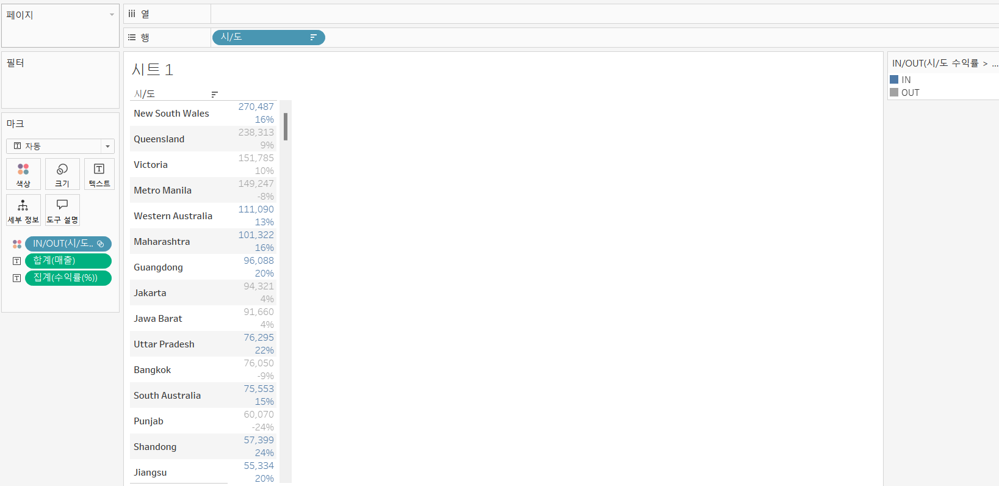
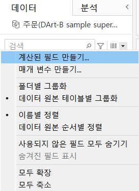
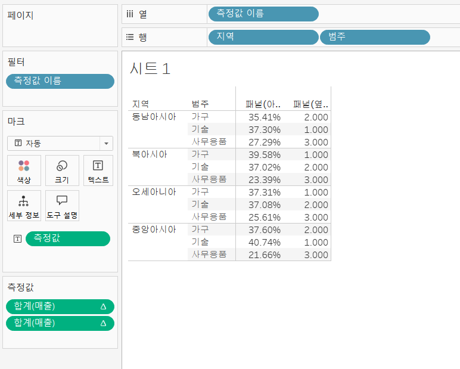

# Fourth Study Week

- 30강: [계층](#30-계층)

- 31강: [집합](#31-집합)

- 32강: [결합집합](#32-결합집합)

- 33강: [계산된 필드](#33-계산된-필드)

- 34강: [행수준계산](#34-행수준계산)

- 35강: [집계계산](#35-집계계산)

- 36강: [테이블계산](#36-테이블계산)

- 37강: [퀵테이블계산(1)](#37-퀵테이블계산1)

- 38강: [퀵테이블계산(2)](#38-퀵테이블계산2)

- [문제1](#문제-1)

- [문제2](#문제-2)

- [문제3](#문제-3)

## Study Schedule

| 강의 범위     | 강의 이수 여부 | 링크                                                                                                        |
|--------------|---------|-----------------------------------------------------------------------------------------------------------|
| 1~9강        |  ✅      | [링크](https://www.youtube.com/watch?v=AXkaUrJs-Ko&list=PL87tgIIryGsa5vdz6MsaOEF8PK-YqK3fz&index=84)       |
| 10~19강      | ✅      | [링크](https://www.youtube.com/watch?v=AXkaUrJs-Ko&list=PL87tgIIryGsa5vdz6MsaOEF8PK-YqK3fz&index=75)       |
| 20~29강      | ✅      | [링크](https://www.youtube.com/watch?v=AXkaUrJs-Ko&list=PL87tgIIryGsa5vdz6MsaOEF8PK-YqK3fz&index=65)       |
| 30~38강      | ✅      | [링크](https://youtu.be/e6J0Ljd6h44?si=nhGbB7GsdOCqj15f)       |
| 39~49강      | 🍽️      | [링크](https://www.youtube.com/watch?v=AXkaUrJs-Ko&list=PL87tgIIryGsa5vdz6MsaOEF8PK-YqK3fz&index=45)       |
| 50~59강      | 🍽️      | [링크](https://www.youtube.com/watch?v=AXkaUrJs-Ko&list=PL87tgIIryGsa5vdz6MsaOEF8PK-YqK3fz&index=35)       |
| 60~69강      | 🍽️      | [링크](https://www.youtube.com/watch?v=AXkaUrJs-Ko&list=PL87tgIIryGsa5vdz6MsaOEF8PK-YqK3fz&index=25)       |
| 70~79강      | 🍽️      | [링크](https://www.youtube.com/watch?v=AXkaUrJs-Ko&list=PL87tgIIryGsa5vdz6MsaOEF8PK-YqK3fz&index=15)       |
| 80~89강      | 🍽️      | [링크](https://www.youtube.com/watch?v=AXkaUrJs-Ko&list=PL87tgIIryGsa5vdz6MsaOEF8PK-YqK3fz&index=5)        |

<!-- 여기까진 그대로 둬 주세요-->

> **🧞‍♀️ 오늘의 스터디는 지니와 함께합니다.**


## 30. 계층

<!-- 계층 구조와 관련된 개념, 사용 방법 등을 적어주세요. -->
```
계층 : 뷰에서 데이터를 Drill Down해 값을 세부적으로 찾을 때 유용

Tableau에서는 자동으로 날짜 데이터로 계층 생성

계층 생성법 :

우클릭 -> 계층 -> 계층 만들기
```


## 31. 집합

<!-- 집합의 정의 및 활용 방법에 대해 알게 된 점을 적어주세요. -->
```
집합 : 어떤 조건을 설정하고 그 조건을 기반으로 데이터를 구분하는 방법

'수익을 많이 낸 상위 10개 도시 표현' :

집합 생성법 :

우클릭 -> 만들기 -> 집합

만든 집합을 색상으로 드래그해 구분!
```


## 32. 결합집합

<!-- 결합집합의 개념 및 사용 사례를 적어주세요. -->
```
집합 - 하나의 조건 설정 가능
결합된 집합 - 두 가지의 조건 설정 가능

'매출이 5만원 이상이고, 수익률이 10% 이상인 도시의 데이터를 구분'

결합된 집합 생성법 :

1. 먼저 시/도 매출이 5만원 이상인 집합 생성
2. 다음으로 계산된 필드를 활용해 '수익률' 생성
3. 동일하게 시/도 수익률이 10% 이상인 집합 생성
 -> 기존 소수점으로 표시된 수익률을 백분율로 표시하기 위해 서식에거 백분율로 변경
4. 처음에 생성한 시/도 매출 > 50,000 집합 우클릭 -> 결합된 집합 만들기 ->

```




```
위 사진에서 볼 수 있는 결합의 네 가지 방법 :
1. 두 집합의 모든 멤버 : 두 집합에 해당하는 모든 데이터 표시
 -> 매출 50,000원 이상 혹은 수익률 10% 이상인 도시가 표시됨

2. 두 집합의 공유 멤버 : 
 -> 매출 50,000원 이상이고 수익률 10% 이상인 도시가 표시됨

3. 공유 멤버를 제외한 '시/도 매출 > 50,000'
 -> 매출이 50,000원 이상이지만 수익률이 10% 이하인 도시가 표시됨

4. 공유 멤버를 제외한 '시/도 수익률 > 10%'
 -> 수익률이 10% 이상이지만 매출이 50,000원 이하인 도시가 표시됨
```


```
매출이 5만원 이상이고, 수익률이 10% 이상인 도시를 알고 싶으므로 네 가지 옵션 중 두 집합의 공유 멤버를 클릭하면 위와 같은 결과를 도출할 수 있음 
```

## 33. 계산된 필드

<!-- 계산된 필드를 사용하는 방법과 예시를 적어주세요. -->
```
계산된 필드 : 데이터 원본에 있는 필드를 활용하여 새로운 필드 생성

기존 데이터 이외에 계산해야 할 데이터가 추가로 필요한 경우 계산된 필드 활용

계산된 필드 세 가지 생성법 :
1. 데이터 패널을 통해 생성
2. 분석 탭을 활용해 생성
3. 사용하고자 하는 필드 우클릭 -> 만들기 -> 계산된 필드
```
```
데이터 패널을 통한 생성 :
```


```
분석 탭을 통한 생성 :
```


```
필드 우클릭을 통한 생성 :
```


```
아래 사진처럼 드롭다운 메뉴를 클릭하면 다양한 함수 목록 확인 가능
```


```
필드를 입력하는 두 가지 방법 :
1. 필드를 드래그 앤 드롭
2. 아래 사진처럼 필드 이름을 입력해서 관련 필드 선택
```


```
이전에는 서식에서 바꿨지만 올바른 방법 :
수익률 우클릭 -> 기본 속성 -> 숫자 형식 -> 백분율로 변경 
```


```
제품별 수익률 확인 :
```


## 34. 행수준계산

<!-- 행수준 계산의 의미와 적용 방법을 적어주세요. -->
```
계산된 필드 세 종류 :
1. 기본 계산
2. 테이블 계산
3. LOD 표현식
```
```
기본 계산 : 데이터 원본에 대한 행 수준 계산 또는 집계 계산
- 행 수준 계산 : 데이터의 각 레코드를 통해 계산하는 방식
- 집계 계산 : 현재 뷰에서 보이는 것 기준으로 계산하는 방식 
```
```
'"고객 이름"을 성과 이름으로 분리'

행 수준 계산 실습 :
1. '"고객 이름"을 성과 이름으로 분리'
```
```
아래 사진처럼 SPLIT은 중간 구분 기호를 기준으로 앞 1, 뒤 2로 숫자를 매김
```


```
2. '수익성이 있는 제품 확인'
```


```
3. '두 날짜 사이의 일 수 찾기'
```


```
주문 날짜 우클릭 -> 더보기 -> 사용자 지정 -> 연도/월/일로 변경
```


```
생성한 주문 처리 일수 필드를 텍스트로 드래그하면 위와 같이 일 수를 확인할 수 있음

그러나, 두 번째 줄을 보면 두 날짜 간의 차이가 4일임에도 불구하고 12일이라고 표시되는 것을 볼 수 있음
-> 이는 어떤 주문 id들이 여러 개의 제품 레코드를 가지고 있어 계산된 필드에서 일 수를 전부 합계 처리하기 때문

이를 해결하기 위해 해당 필드를 '측정값'에서 '차원값'으로 변경해야 함!!

아래 사진에서처럼 차원으로 변경하고 다시 텍스트로 드래그하면 값이 잘 나오는 것을 확인할 수 있음
```


## 35. 집계계산

<!-- 집계계산의 정의 및 활용 사례에 대해 알게 된 점을 적어주세요. -->
```
집계 계산 : 현재 뷰에서 보이는 것 기준으로 계산하는 방식

기본으로 설정되어 있는 집계 계산 변경 :
필드 우클릭 -> 기본 속성 -> 집계 -> 원하는 집계 방식 선택

계산된 필드에서는 집계를 선택하면 해당 집계함수를 사용할 수 있음
```


```
아래 사진을 보면 동일한 계산식임에도 불구하고 기존 매출은 합계로 표시되지만, 계산된 필드로 생성한 매출은 집계로 표시됨

또한, 기존 합계(매출)은 우클릭하면 측정값 변경이 가능하지만, 계산된 필드로 생성된 매출은 우클릭해도 측정값 옵션이 없는 것을 확인할 수 있음
```


```
집계 계산 실습 :
'연도별 주문건수 확인'
```

```
하나의 (주문)id가 여러 제품을 주문하면 해당 id가 모든 제품들에 표시되기 때문에 'COUNTD' 함수를 사용
```

```
2022년 마크 우클릭 -> 데이터 보기

요약을 보면 고유 주문건수는 1,168건이지만, 전체 데이터를 보면 2,353건임을 확인할 수 있음

또한, 아래 세 번째 사진처럼 주문id로 정렬하면 동일한 id를 가진 제품이 여러 개 있다는 것을 알 수 있음
```


## 36. 테이블계산

<!-- 테이블 계산의 개념 및 사용 방법을 적어주세요. -->
```
테이블 계산 : 뷰에 보이는 내용을 바탕으로 데이터가 계산됨

테이블 계산 실습 :
```
```
Tableau에서 사용할 수 있는 테이블 계산 함수 :
```


```
월, 연도에 따라 누적 매출 확인 :
```


```
아래 사진에서 누적 매출의 세모 표시는 테이블 계산 필드를 의미

Tableau에서는 테이블 계산을 만들 때 자동적으로 계산 방향이 테이블 (옆으로) 설정되어 있음

이를 변경하는 두 가지 방법 :
1. 필드 우클릭 -> 다음을 사용하여 계산 -> 원하는 방향 선택
2. 필드 우클릭 -> 테이블 계산 편집 -> 계산 방향 선택 및 계산 옵션 추가 가능
```


```
필드 우클릭 -> 테이블 계산 편집 -> 특정 차원 선택 -> 주문 날짜의 월 체크
 -> 아래 사진처럼 해당 연도와 분기마다 월 매출을 누적해서 계산

필드 우클릭 -> 테이블 계산 편집 -> 특정 차원 선택 -> 주문 날짜의 연도 체크
 -> 달과 분기마다 연도 매출을 누적해서 계산

아래 세 번째 사진처럼 정렬 순서 -> 사용자 지정을 통해 원하는 정렬 기준을 선택할 수 있음
```


```
'현재 달과 전 월의 매출 차이'
 -> LOOKUP 함수!

1. 주문 날짜의 년과 월을 행으로, 매출은 더블 클릭
2. 계산된 필드 생성
3. 생성한 필드 더블 클릭
```


## 37. 퀵테이블계산(1)

<!-- 퀵테이블 계산의 원리 및 예제에 대해 알게 된 점을 적어주세요. -->
```
퀵 테이블 계산 : 테이블 계산에서 자주 쓰이는 계산 유형들을 클릭만으로 가능하도록 만들어 놓은 기능
```
```
우리가 지금까지 자주 해왔던 거 퀵테이블 계산
```


```
퀵 테이블 계산 실습 :

1. 누계 : 집계한 값을 누적

'분기별 누적 매출 & 월별 매출 차트' :

1. 연속형 분기를 열로, 매출을 행으로 드래그
2. 이중축 생성을 위해 매출 필드를 Ctrl + 옆으로 드래그
3. 복제한 매출 필드 우클릭 -> 퀵테이블 계산 -> 누계
4. 이중축 적용 및 축 동기화 클릭
```


```
퀵 테이블 계산이 적용된 필드를 더블 클릭하면 아래 사진처럼 적용된 함수를 확인할 수 있음
```


```
2. 차이 : 측정값이 기준 값과 어느 정도 차이가 나는지 계산

'각 제품에 대한 연도별 매출 차이' :

1. 주문날짜를 열로, 범주를 행으로, 매출을 텍스트로 드래그
2. 매출 우클릭 -> 퀵 테이블 계산 -> 차이
```


```
아래 사진처럼 기준을 보면 '이전'이 기본 값이고, 원하는 방식에 따라 '다음', '첫 번째', '지난'을 선택할 수 있음
```


```
3. 비율 차이 : 측정값들 사이의 성장률 또는 % 차이를 계산

'월별 수익 차이(%)' :

1. 연속형 월을 열로, 수익을 행으로 드래그
2. 수익 우클릭 -> 퀵 테이블 계산 -> 비율 차이
3. 기존 라인 그래프를 막대 그래프로 변경
4. 행 선반에 있는 수익을 색상으로 Ctrl + 드래그
5. 범례 더블클릭 -> 단계별 색상 체크 -> 2단계
```


```
4. 구성 비율 : 전체에서 각 항목들의 비중을 확인

'지역별 제품 매출 순위와 구성 비율 표시' :

1. 지역 및 범주를 행으로, 매출을 텍스트로 드래그
2. 매출 우클릭 -> 퀵 테이블 계산 -> 순위
3. 매출 우클릭 -> 다음을 사용하여 계산 -> 패널(옆에서 아래로) 선택
 -> 아래 두 번째 사진처럼 기존 순위가 지역 별이 아닌 전체로 매겨지기 때문
4. 매출 더블클릭(추가)
5. 매출 우클릭 -> 퀵 테이블 계산 -> 구성 비율
6. 매출 우클릭 -> 다음을 사용하여 계산 -> 패널(아래로) 선택
 -> 이전 순위랑 동일한 원리
```




```
5. 백분위수 : 전체에서 각 멤버들의 백분위를 표시

'매출이 많은 고객과 매출이 적은 고객 표시' :

1. 고객 이름 및 매출 더블클릭
2. 매출 우클릭 -> 퀵 테이블 계산 -> 백분위수
3. 내림차순을 통해 백분위수 확인
```


## 38. 퀵테이블계산(2)

<!-- 이동평균, YTD 총계, 전년 대비 성장률, YTD 성장률 등 본 강의에서 알게 된 점을 적어주세요. -->
```
1. 이동 평균 : 이전의 값부터 현재까지 값에 대한 평균을 낼 때 사용
 -> 주식 데이터에서 많이 활용

이동 평균 실습 :

1. 연속형 분기를 열로, 매출을 행으로 드래그
2. 매출을 옆으로 복사
3. 복사한 매출 우클릭 -> 퀵 테이블 계산 -> 이동 평균
 -> 매출 합계를 기준으로 이동 평균한 값이 라인 차트로 표시됨
4. 두 개 매출을 모두 텍스트로 Ctrl + 드래그
5. 이중축 적용 및 축 동기화
 -> 실제 매출 그래프와 이동 평균한 매출 그래프를 비교하기 위함
```


```
매출 우클릭 -> 테이블 계산 편집
 -> 해당 값이 어떻게 계산되었는지 확인 가능
```

```
평균, 이전 2, 다음 0 : 현재 레이블로 표시되는 각각의 분기를 기준으로 이전 두 분기와 현재 분기의 분기별 평균
```


```
2. YTD(Year to Date) 총계 : 특정 시점을 기준으로 해당 연도부터 그 시점까지의 총계
 -> '누계'와 같은 개념이지만 '연도'보다 하위 레벨 필드인 '분기' 또는 '월'이 있어야 사용 가능

YTD(Year to Date) 총계 실습 :

1. 주문날짜의 년, 월을 행으로, 매출을 텍스트로 드래그
2. 매출 우클릭 -> 퀵 테이블 계산 -> YTD 총계
```

```
추가적으로 매출을 더블 클릭해 YTD 총계가 맞게 들어간 것을 확인할 수 있음
```


```
3. 통합 성장률(Compound Growth Rate)

통합 성장률 실습 :

1. 주문 날짜의 년, 분기를 행으로, 매출을 텍스트로 드래그
2. 매출 우클릭 -> 퀵 테이블 계산 -> 통합 성장률
```


```
4. 전년 대비 성장률 : 같은 월을 기준으로 이전 연도 대비 얼마나 성장했는지 표시

전년 대비 성장률 실습 :

1. 주문날짜의 년, 월을 행으로, 매출을 텍스트로 드래그
2. 매출 우클릭 -> 퀵 테이블 계산 -> 전년 대비 성장률
```


```
5. YTD(Year to Date) 성장률 : 

YTD 성장률 실습 :

1. 주문날짜의 년, 월을 행으로, 매출을 텍스트로 드래그
2. 매출 우클릭 -> 퀵 테이블 계산 -> YTD 성장률
3. 추가적으로 매출 더블클릭 
 -> 성장률 값 검정을 위함
4. 처음 매출 필드 더블클릭하면 동작을 완료할 수 없다는 에러가 표시됨
 -> 에러 발생 이유 : 단일 계산식이 아니기 때문
5. 처음 매출 필드를 데이터 패널로 Ctrl 드래그하면 임시 필드인 계산1과 계산1 1이 생성된 것을 알 수 있음
 -> 성장률 안에 총계가 숨어 있기 때문
6. 계산1은 YTD 총계, 계산1 1은 YTD 성장률로 rename
7. YTD 총계를 측정값 중간에 드래그 후 확인
```


## 문제 1.

규석이는 이제껏 매출을 올리는 데에 힘썼었지만, 왠지 모르게 주머니에 들어오는 돈이 없어 속상합니다. 

그래서 매출이 상위 20곳에 속하지만, 수익률(%)이 마이너스인 시/도를 확인하려고 합니다.

> 수익률은 SUM([수익]) / SUM([매출])로 정의합니다.

어떤 집합을 만들었고, 어떤 결합을 하였는지를 중심으로 기술하고, 결과 자료를 첨부해주세요. 

(텍스트 표 형태이며, 색상으로 위 집합을 구분할 수 있게 만들어주세요.)

```
1. 먼저 두 개의 집합 생성 :
시/도 우클릭 -> 만들기 -> 집합

(1) 상위 탭에서 조건에 맞게 집합 생성(시/도 매출 상위 20)
(2) 조건 탭에서 조건에 맞게 집합 생성(시/도 수익률(%) 마이너스)

2. 만든 집합 우클릭 -> 결합된 집합 만들기 -> 두 집합의 공유 멤버 선택
3. 시/도를 행으로, 매출, 수익, 수익률을 더블클릭, 그리고 만든 집합을 색상으로 드래그

위 과정을 거치면 마지막 사진처럼 매출이 상위 20이지만 수익률(%)이 마이너스인 시/도를 구분해서 볼 수 있음
 -> 기존 색상이 잘 보이지 않아, 다른 색상으로 변경
```


<!-- 아래 예시 이미지를 삭제하고, 직접 만든 시트 사진을 올려주세요. 시트의 이름은 본인 이름으로 기입해주세요-->


## 문제 2.
선희는 주문 Id별로 주문에서 배송까지에 걸리는 날짜 일수가 궁금했습니다. 
그래서 주문 ID별로 주문에서 배송까지 걸리는 일자를 '배송까지 걸린 일수'라는 계산된 필드로 만들고, 이를 마크에 올린 후 확인해보았습니다. 
이때, 계산된 필드의 식은 'DATEDIFF' 함수를 이용하였습니다.

배송까지 걸린 일수 계산을 위한 DATEDIFF 함수 수식을 적어주세요.

```
DATEDIFF(날짜_부분, 시작_날짜, 끝_날짜)
DATEDIFF('day', [주문 날짜], [배송 날짜])
```


그런데 위 그림처럼 '주문 날짜'와 '배송 날짜'를 함께 행에 올려 확인해보니, 주문날짜와 배송날짜의 차이가 '배송까지 걸린 일수'와 다릅니다.

ID-2021-11126을 보니, 11월 26일 배송에 11월 30일 배송이면 4일 차이인데, 12일이 걸렸다고 하네요. 왜 이런 문제가 생긴걸까요?

```
문제 발생 이유 : 어떤 주문 id들이 여러 개의 제품 레코드를 가지고 있어 계산된 필드에서 이 일 수를 전부 합계로 처리하기 때문
```

그리고 이를 해결하기 위해서는 어떻게 해야 할까요?

```
해결 방법 : 해당 필드를 '측정값'에서 '차원값'으로 변경하면 문제없이 값이 출력됨!!
```

사진은 ## 34. 행 수준 계산에 있으므로 이 부분 생략


## 문제 3.

다음은 Tableau의 다양한 계산을 사용할 수 있는 경우를 빈칸으로 두고 문제를 작성한 것입니다. 각 빈칸에 적합한 계산 유형을 채워보세요.

보기
> **누계, 차이, 비율 차이, 구성 비율, 순위, 백분위수, 이동 평균, YTD 총계, 통합 성장률, 전년 대비 성장률, YTD 성장률**

| 계산 유형               | 설명                                                                 | 사용 예시                                                                                          |
|-------------------------|----------------------------------------------------------------------|-----------------------------------------------------------------------------------------------------|
| 누계           | 데이터의 누적 합계를 계산                                             | 한 기업이 월별 매출 데이터를 누적하여 연간 매출 추이를 보고 싶을 때 사용                                      |
| 차이            | 연속 데이터 포인트 간의 차이를 계산                                    | 한 기업이 월별 매출 데이터에서 전월 대비 매출 증감량을 분석하고 싶은 경우                                        |
| 비율 차이            | 연속 데이터 포인트 간의 비율 변화를 계산                               | 한 기업이 월별 매출 데이터에서 전월 대비 매출 증감률(%)을 분석하고 싶은 경우                                      |
| 구성 비율            | 전체에서 각 데이터 포인트의 비율을 계산                                | 한 기업이 전체 매출에서 각 제품군이 차지하는 비율을 보고 싶을 때 사용                                           |
| 순위            | 데이터의 순위를 매깁니다                                              | 한 기업이 제품별 매출 데이터를 순위별로 정렬하여 상위 10개 제품을 분석하고 싶은 경우                              |
| 백분위수            | 데이터의 백분위를 계산                                               | 한 기업이 고객별 구매 금액 데이터를 백분위수로 나누어 상위 25% 고객을 분석하고 싶은 경우                          |
| 이동 평균            | 일정 기간의 평균을 계산                                               | 한 기업이 주간 매출 데이터에서 4주 이동 평균을 계산하여 트렌드를 분석하고 싶은 경우                              |
| YTD 총계            | 연초부터 현재까지의 총계를 계산                                      | 한 기업이 월별 매출 데이터를 연초부터 현재까지 누적하여 연간 매출 목표 달성 여부를 분석하고 싶은 경우             |
| 통합 성장률            | 일정 기간 동안의 연평균 성장률을 계산                                  | 한 기업이 5년 간 매출 데이터를 바탕으로 연평균 성장률(CAGR)을 계산하고 싶은 경우                                  |
| 전년 대비 성장률            | 전년 동기간 대비 성장률을 계산                                        | 한 기업이 월별 매출 데이터에서 전년 동월 대비 매출 성장률을 분석하고 싶은 경우                                    |
| YTD 성장률            | 연초부터 현재까지의 성장률을 계산                                     | 한 기업이 올해 연초부터 현재까지의 매출이 전년 동기 대비 얼마나 성장했는지 분석하고 싶은 경우                     |

> 사용 예시를 참고하여 실제 경우처럼 생각하며 고민해보아요!