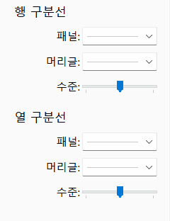
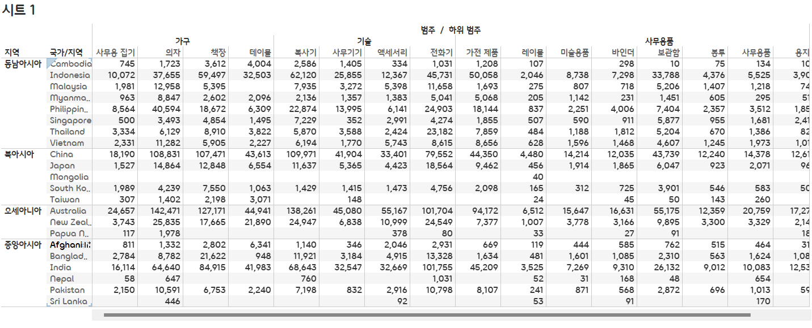
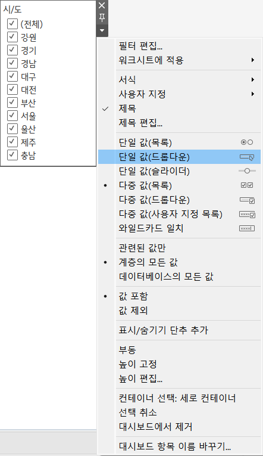
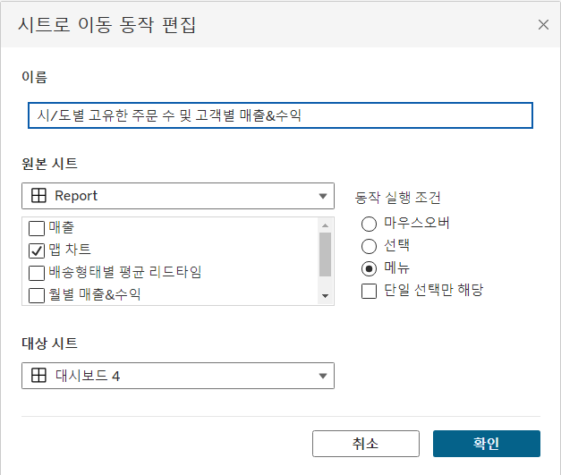
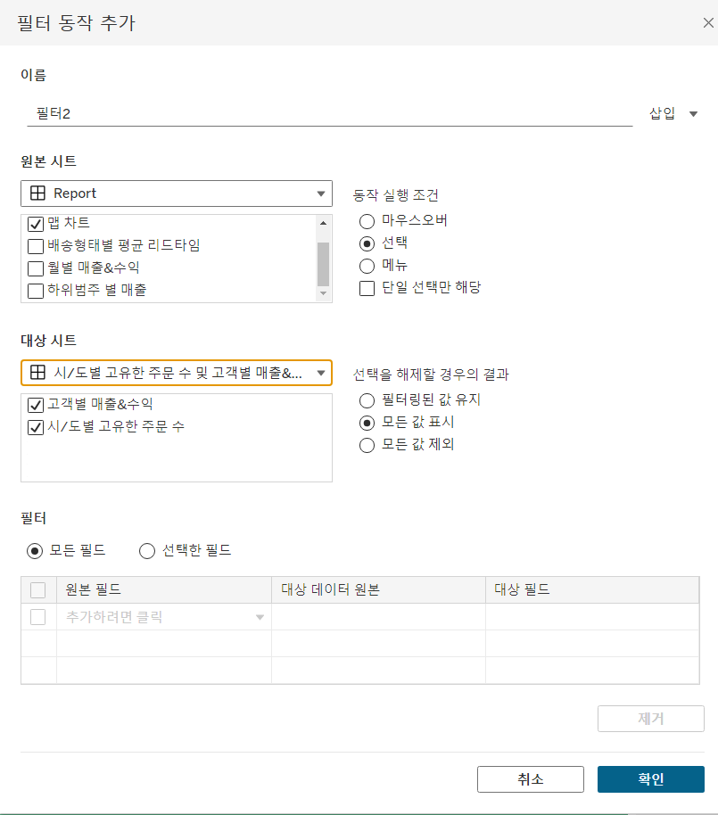
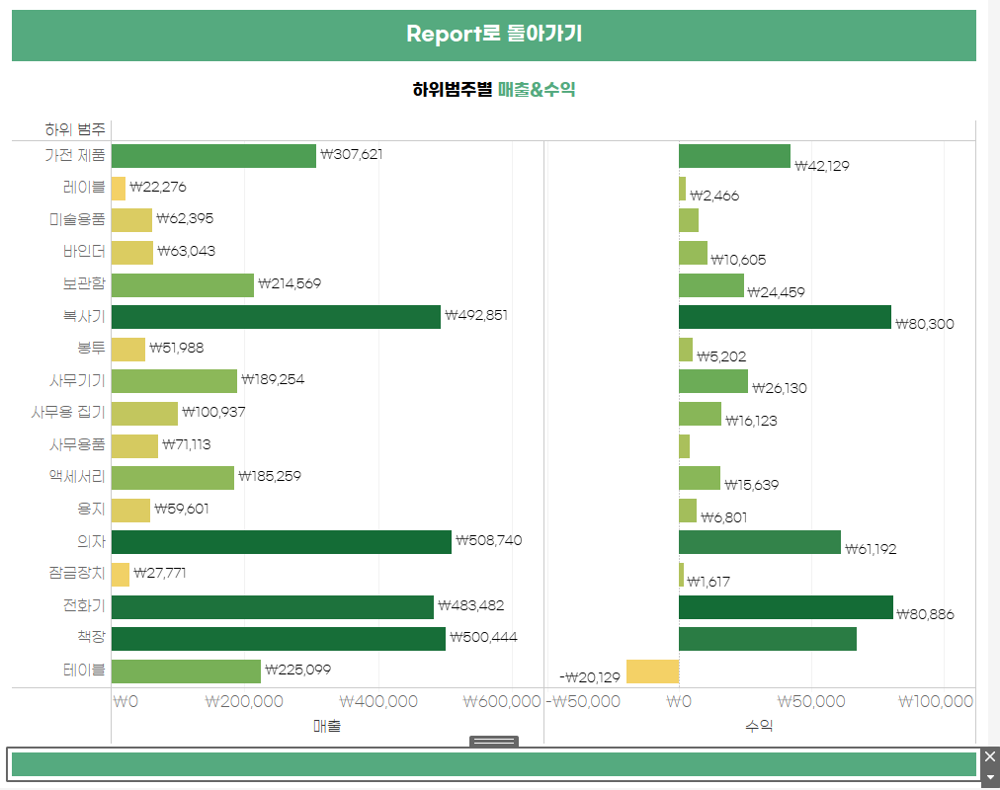

# Sixth Study Week


## Study Schedule
<br>

| 회차 | 강의 범위   | 강의 이수 여부 | 링크                                                                                                     |
|------|-------------|----------------|--------------------------------------------------------------------------------------------------------|
| 1    | 1~7강       | ✅              | [링크](https://www.youtube.com/watch?v=AXkaUrJs-Ko&list=PL87tgIIryGsa5vdz6MsaOEF8PK-YqK3fz&index=84)    |
| 2    | 8~17강      | ✅              | [링크](https://www.youtube.com/watch?v=AXkaUrJs-Ko&list=PL87tgIIryGsa5vdz6MsaOEF8PK-YqK3fz&index=75)    |
| 3    | 18~27강     | ✅              | [링크](https://www.youtube.com/watch?v=AXkaUrJs-Ko&list=PL87tgIIryGsa5vdz6MsaOEF8PK-YqK3fz&index=65)    |
| 4    | 28~37강     | ✅              | [링크](https://www.youtube.com/watch?v=e6J0Ljd6h44&list=PL87tgIIryGsa5vdz6MsaOEF8PK-YqK3fz&index=55)    |
| 5    | 38~47강     | ✅              | [링크](https://www.youtube.com/watch?v=AXkaUrJs-Ko&list=PL87tgIIryGsa5vdz6MsaOEF8PK-YqK3fz&index=45)    |
| 6    | 48~57강     | ✅              | [링크](https://www.youtube.com/watch?v=AXkaUrJs-Ko&list=PL87tgIIryGsa5vdz6MsaOEF8PK-YqK3fz&index=35)    |
| 7    | 58~67강     | 🍽️             | [링크](https://www.youtube.com/watch?v=AXkaUrJs-Ko&list=PL87tgIIryGsa5vdz6MsaOEF8PK-YqK3fz&index=25)    |
| 8    | 68~77강     | 🍽️             | [링크](https://www.youtube.com/watch?v=AXkaUrJs-Ko&list=PL87tgIIryGsa5vdz6MsaOEF8PK-YqK3fz&index=15)    |
| 9    | 78~85강     | 🍽️             | [링크](https://www.youtube.com/watch?v=AXkaUrJs-Ko&list=PL87tgIIryGsa5vdz6MsaOEF8PK-YqK3fz&index=5)     |
---

<br/>
<!-- 여기까진 그대로 둬 주세요-->

> **🧞‍♀️ 오늘은 강의보다 실습과 대시보드 직접 만들기가 더 중요하니, 기록보다는 사고하며 강의를 들어주세요.**

## 48. 워크시트 서식(2)

<!-- 워크시트에 관해 본 강의에서 알게 된 점을 적어주세요 -->

```
테두리 서식 실습 :

1. 지역, 국가/지역을 행으로, 범주, 하위 범주를 열로 드래그 및 매출 더블 클릭
2. 서식 -> 테두리

```

```
아래 사진처럼 행과 열 구분선에서 테두리의 필드 기준을 선택할 수 있음
```


```
행 구분선 
- 첫 번째 눈금
- 두 번째 눈금
- 세 번째 눈금
```


```
열 구분선 
- 첫 번째 눈금
- 두 번째 눈금
- 세 번째 눈금
```




```
데이터를 기준으로 테두리와 라인을 구분 :

- 테두리 서식 : 뷰에서 테이블, 패널, 셀 및 머리글을 둘러싸는 테두리 서식을 설정

- 라인 서식 : 뷰에서 표시된 데이터의 축에 대한 라인의 모양을 설정
```

```
라인 서식 실습 :

1. 연속형 월을 열로 매출을 행으로 드래그
2. 서식 -> 라인
 : 라인의 유형, 두께 및 색상 설정이 가능하고 0 기준선을 변경할 수도 있음
3. 분석 -> 추세선 & 참조선
 : 각 라인들에 서식을 별도로 설정할 수 있음
```


## 49강. 대시보드패널

<!-- 대시보드패널 강의에서 알게 된 점을 적어주세요. -->

```
대시보드 : 여러 개의 차트를 한 번에 표시
```


```
크기 : 대시보드의 크기 설정

 고정된 크기
 자동 : 화면을 채움
 범위 : 크기 범위 선택 
```


```
시트 : 대시보드에서 사용할 수 있는 워크시트
```


```
개체 : Tableau가 지원하는 다른 개체

Drag and Drop을 통해 대시보드에 추가할 수 있음

호주 관련 대시보드 실습 :

1. 텍스트 상자 개체 Drag and Drop - 제목
2. 이미지 개체 Drag and Drop - 국기 
 : 나무위키 링크를 통해 사진 추가
3. 웹 페이지 개체 Drag and Drop - 호주에 대한 정보를 보여주는 웹사이트 경로
4. 기기 미리 보기 -> 기기 유형 -> 모델 - 디바이스별 해상도 적용
 : Tableau 내 대시보드는 여러 가지 디바이스별 해상도를 지원
```


## 50. 대시보드 구성방식

<!-- 알게 된 점을 적고, 아래 질문에 답해보세요 :) -->

```
개체를 추가하는 두 가지 방식 :

1. 바둑판식 : 격자무늬 구조에 따라 개체를 구성할 수 있음
2. 부동(Shift + 개체) : 사용자가 원하는 대로 개체를 자유롭게 Drag and Drop하여 배치할 수 있음
```


> **🧞‍♀️ 부동과 바둑판식 방식을 차이를 중점으로 기술해보세요**

```
바둑판식 방식 :
- 격자무늬 구조의 특정 위치에만 추가 가능
- 해당 개체를 추가하면 다른 개체들의 크기가 변경됨

부동 방식 :
- 원하는 위치에 Drag and Drop 가능
- 해당 개체를 움직이더라도 다른 개체의 크기나 모양에는 영향을 주지 않음
```

```
조언 :

바둑판식 사용을 추천 : 

대시보드의 크기가 자주 변경되는 경우
 - 대시보드 크기를 변경해도 개체가 유사한 형식을 유지할 수 있기 때문

부동 방식 사용 추천 :

1. 대시보드의 크기가 자주 변경되지 않는 경우
2. 그래프 내에 빈 공간이 많은 경우
 - 부동 개체를 사용해 해당 빈 공간을 채울 수 있기 때문
```

## 51. 대시보드 컨테이너

```
개체를 대시보드에 배치하기 전에 컨테이너를 먼저 배치할 수 있음

컨테이너 : 대시보드 개체들과 워크시트들을 그룹화하고 구성할 수 있는 공간

두 가지 컨테이너 개체 :

1. 가로 : 내부의 개체들을 수평 공간으로 배열할 때 사용
2. 세로 : 내부의 개체들을 수직 공간으로 배열할 때 사용
```


```
세로 컨테이너 실습 :

1. 세로 컨테이너 개체 Drag and Drop
2. 빈 페이지 개체 Drag and Drop
3. 레이아웃 확인
 : 컨테이너를 제대로 배치했는지 확인하기 위함

대시보드를 어떻게 구성할 지 그 모양에 따라 가로, 세로 컨테이너를 넣어서 작업하면 됨!
```


## 52. 레이아웃 패널

```
레이아웃 탭 : 대시보드의 개체 속성을 변경할 수 있음

- 제목 표시
- 부동 : 부동 개체로 변환
 부동 개체로 변환하고 다시 이전으로 되돌려도 위치는 원래대로 복구되지 않음
- 위치 및 크기 : 부동 개체에 대해서 픽셀 단위로 변경 가능
- 테두리 : 개체 테두리의 선 유형, 두께 및 색상 변경 가능
- 백그라운드 : 선택하는 컨테이너의 색상 변경 가능
- 바깥쪽 여백 : 컨테이너의 모서리와 테두리 사이의 공간 변경
- 안쪽 여백 : 선택된 개체 모서리와 테두리 사이의 공간 변경
- 항목 계층
```


## 53. 필터 동작

<!-- 필터 동작에 대해 알게 된 점을 적어주세요 -->

```
필터 추가 방법 :

차트 -> 드롭다운 메뉴 -> 필터 옵션 선택
```



```
사용자는 동작을 통해 대시보드의 차트와 직접 상호 작용 가능

핕터 동작 실습 :

1. 대시보드 -> 동작
2. 동작 추가 -> 6가지 동작옵션 중 하나를 선택
 여기서는 필터 선택
```


## 54. 대시보드 하이라이터 동작

<!-- 하이라이터에 대해 알게 된 점을 적어주세요 -->

```
하이라이트 동작 : 대시보드에서 데이터를 필터링하는 대신 전체 데이터 중에서 선택한 조건에 따라 데이터를 하이라이트로 구분

하이라이트 동작 실습 :

1. 매출을 열로, 수익을 행으로 드래그
2. 주문 ID와 하위 범주를 더블 클릭
3. 하위범주별 매출 및 수익 차트 생성
4. 대시보드에 두 차트 삽입
5. 대시보드 -> 동작 -> 동작 추가 -> 하이라이트 

이를 통해 원하는 제품의 하위 범주를 나머지 데이터와 구별할 수 있음
```


## 55. 대시보드 URL

<!-- URL에 대해 알게 된 점을 적어주세요 -->

```
대시보드 URL : 사용자가 대시보드와 상호 작용하면 웹 사이트로 이동할 수 있음

대시보드 URL 실습 :

1. 대시보드 -> 동작 -> 동작 추가 -> URL
2. 웹페이지 객체 추가
 : 이때 URL에 아무것도 입력하지 않고 확인 클릭
```


## 56. 대시보드 시트에 이동 동작

<!-- 대시보드 시트에 이동에 대해 알게 된 점을 적어주세요!-->

```
1. 표시하고 싶은 시트가 담긴 새로운 대시보드 만들기
2. 대시보드 -> 동작 -> 동작 추가 -> 시트로 이동
3. 대시보드 -> 동작 -> 동작 추가 -> 필터
 : 시트로 이동해도 필터를 추가하지 않으면 해당 데이터만 반영되지 않기 때문
4. 탐색 개체 추가
5. 탐색 개체 화살표 -> 편집 단추
 : Alt + 탐색 개체를 누르면 이전 시트로 이동
```




## 57. 매개변수 변경 동작

<!-- 매개변수 변경 동작에 대해 알게 된 점을 적어주세요!-->

```
1. 대시보드 -> 동작 -> 매개변수 변경
```


## 문제

오늘은 별도의 문제가 없습니다. 

여러 대시보드를 참고하시어, superstore 데이터를 사용해 나만의 대시보드를 제작해주세요.

**단, 워크시트 3개 이상의 그래프를 표시해야 하며 각 시트 간 상호작용성 필터 or 하이라이트 동작은 꼭 추가되어야 합니다**

어떤 부분에 가중을 두었는지, 어떤 사용자 편의성을 고려하였는지에 대한 설명이 필요합니다.

https://public.tableau.com/app/profile/.22807599/viz/SuperstoreReport_17314154842070/Report?publish=yes


```
메인 대시보드 :

1. 매출, 수량, 수익, 수익률을 보여줌
2. 지역을 북아시아로 한정해서, 시/도별 매출을 보여줌
3. 하위범주별 매출을 보여줌
4. 배송형태별 평균 리드타임을 보여줌

오른쪽 상단에서 국가/지역을 선택할 수 있고,
맵에서 시/도를 클릭하면
해당 시/도에 따라 다른 차트가 변화함

또한, 하위범주별 매출 차트에서 하위범주를 클릭하면
배송형태별 평균 리드타임의 값 또한 변하게 설정해 놓음
```
```
예시 사진 :
```


```
위 사진에서처럼 시/도를 클릭하면

- '시/도별 고유한 주문 수 및 고객별 매출&수익' 
- '하위범주별 매출&수익'

위 두 가지 시트로 이동할 수 있음

마찬가지로 선택한 시/도별로 값이 변하게 설정해 놓음
```



```
전체 대시보드를 통해 알 수 있는 것 :

시/도를 선택했을 때 그동안의 매출 및 가장 많이 팔렸던 하위범주는 어떤 것이고 평균 리드타임이 몇이었는지 알 수 있음

또한, 시/도별 고유한 주문 수와 고객별로 매출 및 수익을 알 수 있어 어떤 고객이 우리제품을 많이 구매하는지 알 수 있음
```
