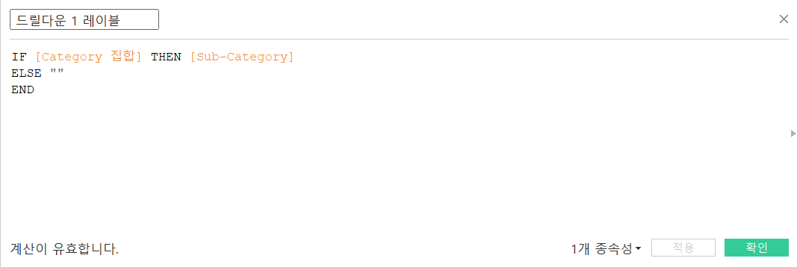
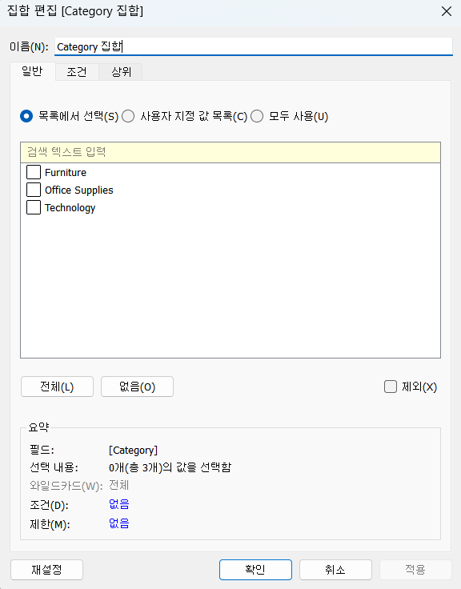

# 7th Study Week

## Study Schedule
<br>

| 회차 | 강의 범위   | 강의 이수 여부 | 링크                                                                                                     |
|------|-------------|----------------|--------------------------------------------------------------------------------------------------------|
| 1    | 1~7강       | ✅              | [링크](https://www.youtube.com/watch?v=AXkaUrJs-Ko&list=PL87tgIIryGsa5vdz6MsaOEF8PK-YqK3fz&index=84)    |
| 2    | 8~17강      | ✅              | [링크](https://www.youtube.com/watch?v=AXkaUrJs-Ko&list=PL87tgIIryGsa5vdz6MsaOEF8PK-YqK3fz&index=75)    |
| 3    | 18~27강     | ✅              | [링크](https://www.youtube.com/watch?v=AXkaUrJs-Ko&list=PL87tgIIryGsa5vdz6MsaOEF8PK-YqK3fz&index=65)    |
| 4    | 28~37강     | ✅              | [링크](https://www.youtube.com/watch?v=e6J0Ljd6h44&list=PL87tgIIryGsa5vdz6MsaOEF8PK-YqK3fz&index=55)    |
| 5    | 38~47강     | ✅              | [링크](https://www.youtube.com/watch?v=AXkaUrJs-Ko&list=PL87tgIIryGsa5vdz6MsaOEF8PK-YqK3fz&index=45)    |
| 6    | 48~57강     | ✅              | [링크](https://www.youtube.com/watch?v=AXkaUrJs-Ko&list=PL87tgIIryGsa5vdz6MsaOEF8PK-YqK3fz&index=35)    |
| 7    | 58~66강     | ✅             | [링크](https://www.youtube.com/watch?v=AXkaUrJs-Ko&list=PL87tgIIryGsa5vdz6MsaOEF8PK-YqK3fz&index=25)    |
| 8    | 67~77강     | 🍽️             | [링크](https://www.youtube.com/watch?v=AXkaUrJs-Ko&list=PL87tgIIryGsa5vdz6MsaOEF8PK-YqK3fz&index=15)    |
| 9    | 78~85강     | 🍽️             | [링크](https://www.youtube.com/watch?v=AXkaUrJs-Ko&list=PL87tgIIryGsa5vdz6MsaOEF8PK-YqK3fz&index=5)     |
---

<br/>

> **🧞‍♀️ 오늘은 강의보다 실습과 대시보드 직접 만들기가 더 중요하니, 기록보다는 사고하며 강의를 들어주세요.**
> **직접 실습파일을 다운로드하는 번거로움이 있어 assignment > 7th_files에 실습파일을 올려두었습니다. 활용해주세요!**


## 58. 집합값 변경

<!-- 집합값 변경 강의에서 알게 된 점을 적어주세요 -->

```
대시보드 -> 동작 -> 동작 추가 -> 집합 값 변경

: 하위 범주를 선택하면 하위 범주 집합의 유일한 값으로 설정되고 선택을 취소하면 해당 집합에서 모든 값이 제거됨

원하는 하위 범주의 더하기 기호를 클릭 : 
 해당 하위 범주의 제품을 만드는 제조업체만 표시됨
 제품 또한 더하기 기호를 클릭하면 해당 제조업체가 만드는 제품을 표시
```


## 59강. 스토리패널

<!-- 스토리패널 강의에서 알게 된 점을 적어주세요 -->

```
스토리 : 워크시트와 대시보드에 설명을 덧붙여 스토리텔링 기능을 구현


새 스토리 포인트 : [빈 페이지]를 선택해 새 스토리 포인트를 추가 or [복제]를 선택해 현재 스토리 포인트를 다음 스토리 포인트의 시작점으로 사용할 수 있음

스토리 패널 : 대시보드, 시트 및 텍스트 설명을 스토리 시트로 가져올 수 있음

새 이름으로 저장 : 선택한 내용이 저장된 상태로 새 스토리 포인트에 그대로 복제되어 작업을 실시 할 수 있음
```


## 60. 스토리

<!-- 알게 된 점을 적고, 아래 질문에 답해보세요 :) -->

```
스토리 : 생성한 워크시트와 대시보드에 설명을 덧붙여 데이터를 설명하거나 정보를 전달하고 의사 결정에 도움을 주고 설득력 있는 사례를 구성하는 등 기능을 구현함

스토리 구성 :
 전체적으로 살펴보면 매출은 문제가 없으나 수익이 적자가 발생하는 항목을 찾아내고, 그 항목 중에서 어떤 제품이 문제가 되는지 찾아내어 해결 방안을 생각할 수 있는 스토리

중요 POINT! :
스토리 포인트 간의 플로우를 잘 구성하고 자신만의 스토리텔링을 완성하여 내용을 분석하고 적절한 인사이트를 얻을 수 있음!!
```


## 61. 대시보드 탐색

<!-- 대시보드 탐색 강의에서 알게 된 점을 적어주세요 -->

```
탐색 개체를 이미지로 변경하고 해당 이미지에 맡는 대시보드를 만든 후 이동할 수 있도록 설정
```


## 62. 태블로 단추

<!-- 태블로 단추 강의에서 알게 된 점을 적어주세요 -->

```
1. 그래프 선택 -> 기타 옵션 -> 표시/숨기기 단추 추가
2. Alt키 누른 상태 아래 두 번째 사진처럼 X자를 클릭하면 세 번째 사진처럼 지도 그래프가 사라지는 것을 알 수 있음

- 각 그래프마다 표시/숨기기 단추 만들기
- 부동 해제
- 아래 사진처럼 위치 이동 및 이미지로 변경
```


## 63. 막대그래프 드릴다운

<!-- 막대그래프 드릴다운에 대해 알게 된 점을 적어주세요 -->

```
드릴 다운이 [배송 형태] - [범주] - [하위 범주] 순서로 이루어지는 막대 그리프 생성 :

1. 매출을 열로, 배송 형태를 행으로 드래그
2. 매출을 색상 및 텍스트로 드래그
3. 매출을 기준으로 내림차순
4. 매개변수 생성
5. 계산된 필드 생성
6. 워크시트 -> 동작 -> 동작 추가 -> 매개 변수 변경
7. 드릴다운1을 행으로 드래그
 : 막대 그래프에서 막대를 선택하면 배송형태에서 범주로 드릴다운 되는 것을 확인할 수 있음

동일한 방식으로 하위 범주 드릴다운도 생성
```


## 64. 트리맵 드릴다운

<!-- 트리맵 드릴다운에 대해 알게 된 점을 적어주세요 -->

```
드릴 다운이 [Category] - [Sub-Category] - [Manufacturer] 순서로 이루어지는 트리맵 생성 :

1. Sales와 Category 더블 클릭 후 표현 방식을 트리맵으로 변경
2. 집합 생성
3. 계산된 필드 생성
4. 워크 시트 -> 동작 -> 동작 추가 -> 집합 값 변경
5. 집합 생성
6. 계산된 필드 생성
7. 워크 시트 -> 동작 -> 동작 추가 -> 집합 값 변경
8. 드릴다운 1에 대한 레이블 필드 추가 
 : 트리맵의 레이블이 중복되는 것을 방지하기 위함
```




## 65. 파이 차트 드릴다운

<!-- 파일 차트 드릴다운에 대해 알게 된 점을 적어주세요 -->

```
드릴 다운이 [Category] - [Sub-Category] 순서로 이루어지는 파이 차트 생성 :

1. Category와 Sales 더블 클릭 후 표현 방식을 파이 차트로 변경
2. 집합 생성
3. 계산된 필드 생성
4. 워크시트 -> 동작 -> 동작 추가 -> 집합 값 변경
5. 크기 마크의 Sales를 제거
6. 드릴다운 1을 세부정보 마크로 드래그하고 마크를 색상으로 변경
7. 행 더블클릭 0 입력 후 임의의 축 생성
8. 첫 번째 축에서 드릴다운 1 제거 후 크기 조정
9. 두 번째 축도 크기 조정
10. 첫 번째 축에서 Category 텍스트 추가
11. 계산된 필드 생성
12. 생성된 필드 두 번째 축의 텍스트로 추가
13. 서식을 통해 행, 열 구분선 및 격자선, 0 기준선을 없음으로 처리
14. 축 머리글 표시 해제

```



## 66. 지도 드릴다운

<!-- 지도 드릴다운에 대해 알게 된 점을 적어주세요 -->

```
드릴 다운이 [국가/지역] - [시/도] 순서로 이루어지는 지도 그래프 생성 :

1. 국가/지역 더블 클릭 후 표현 방식을 맵으로 변경
2. 집합 생성
3. 계산된 필드 만들기
4. 생성된 필드 우클릭 -> 지리적 역할 -> 만들기 원본 -> 시/도
5. 워크시트 -> 동작 -> 동작 추가 -> 집합 값 변경
6. 드릴다운 1을 색상으로 드래그
7. 알 수 없는 항목 우클릭 -> 표시기 숨기기

매개 변수를 이용하여 드릴다운과 선택한 국가/지역만 필터링을 동시에 진행하기 : 

1. 매개 변수 생성
2. 계산된 필드 생성
3. 매개 변수 표시
4. 생성된 필드를 필터로 드래그하고 '참' 선택
5. 워크시트 -> 동작 -> 동작 추가 -> 매개 변수 변경
6. 도구 설명에서 드릴다운 1만 남겨놓고 모두 삭제
```


---

## 문제

오늘은 별도의 문제가 없습니다.

다만, 학술제 이후 마지막 과제(11/27~)로서 한 주 동안에는 학술제 주제 관련 데이터(없을 경우, 본인 관심 데이터)를 사용해 나만의 대시보드를 제작할 예정입니다. 또한, 학술제에서 시각화 시 태블로를 사용하기를 권장하는 안내가 나갈 예정입니다.
그 때 열심히 배운 내용을 잘 활용해주세요. 감사합니다 :)